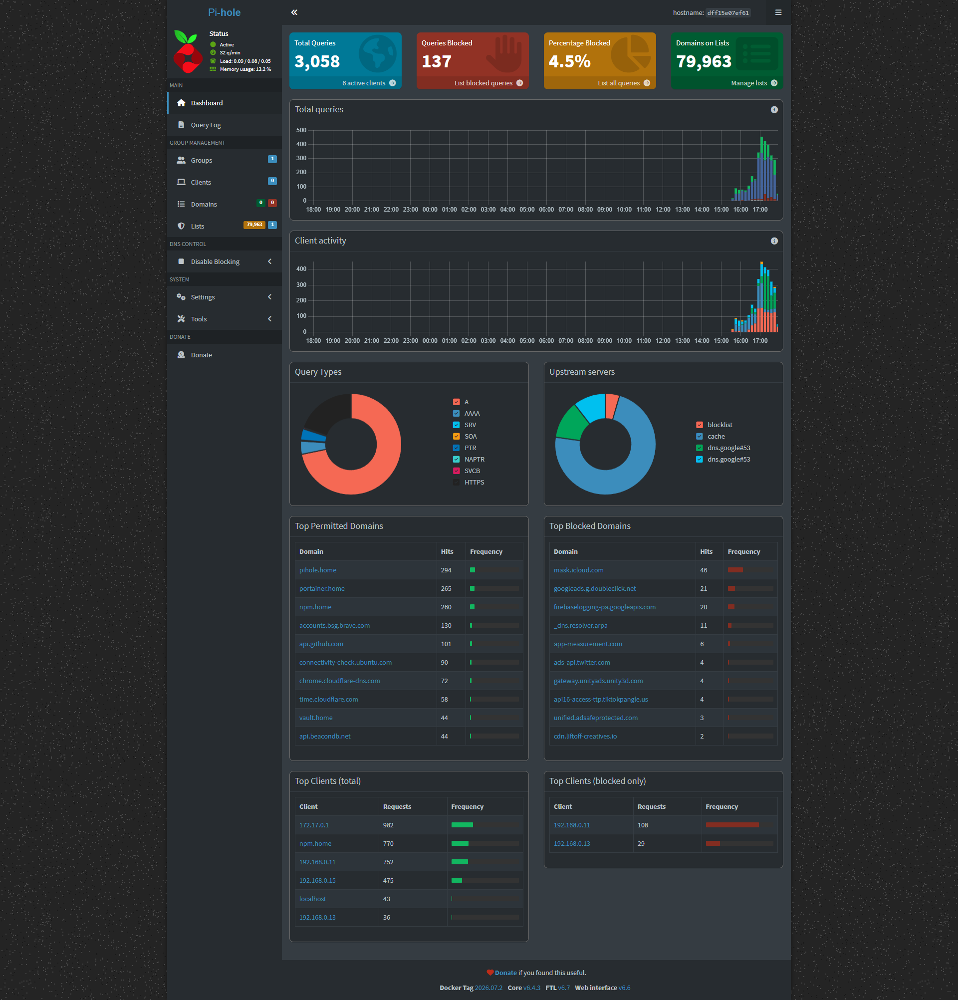
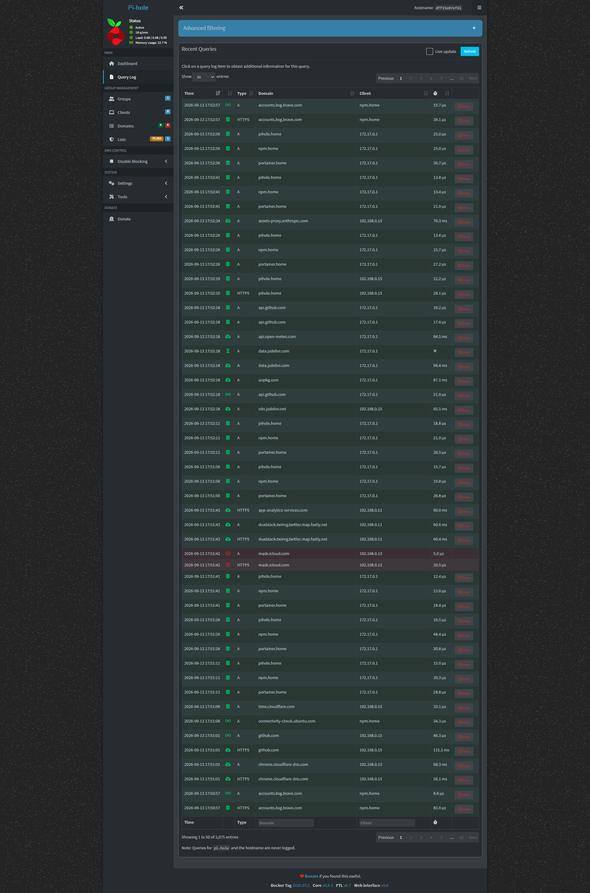
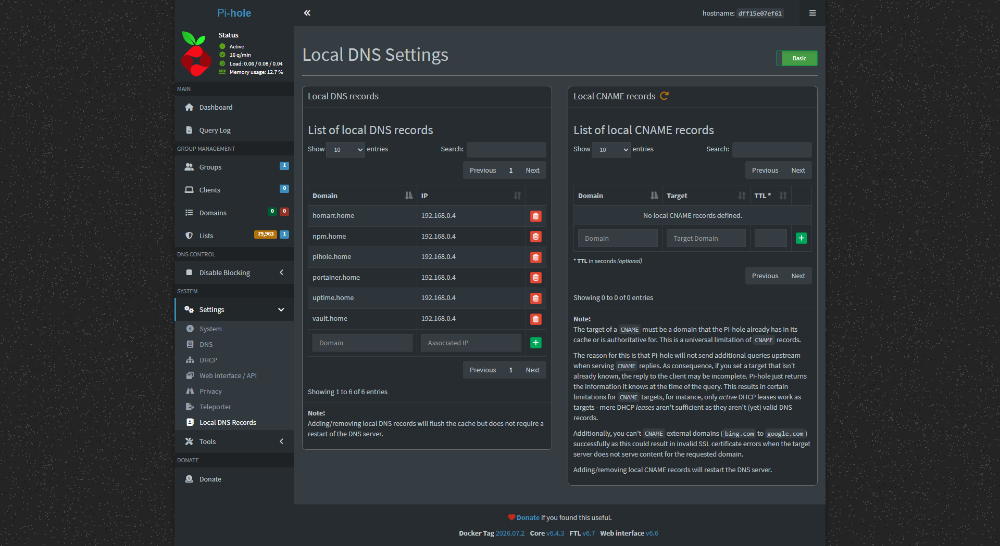

# Pi-hole Network-Wide Ad Blocker (Homelab)

Self-hosted, network-wide DNS ad- and tracker-blocking service deployed via Docker on a repurposed laptop homelab server. Built as a hands-on networking/sysadmin project to gain practical experience with DNS, containerization, and network administration.

## Overview

Pi-hole acts as a DNS sinkhole for the entire home network, blocking ads and trackers at the network level for every connected device — no per-device or per-browser configuration required.

## Environment

| Component        | Details                                      |
|-------------------|-----------------------------------------------|
| Host              | Dell Inspiron 14 7430 2-in-1 (13th Gen i7-1355U, 16GB RAM), hostname `BobbysLaptop` |
| Host OS           | Ubuntu (Linux)                                |
| Deployment method | Docker container                              |
| Server IP         | `192.168.0.4` (manually configured, not a router-assigned static reservation) |
| DNS assignment    | Manual per-device (each client's IPv4 DNS pointed at `192.168.0.4`) |
| Admin UI          | `192.168.0.4:8053/admin` (proxied through Nginx Proxy Manager) |

## Architecture

Pi-hole is one service in a small self-hosted stack running on the same Docker host, fronted by Nginx Proxy Manager for reverse proxying and friendly local hostnames:

```
[ Client Devices ] --DNS query--> [ Pi-hole (Docker, 192.168.0.4) ] --> [ Upstream DNS ]
                                          |
                                    Blocklists (DNS sinkhole)
                                          |
                        [ NPM reverse proxy ] --> pihole.home / portainer.home /
                                                   uptime.home / vault.home / npm.home
```

Each client device's IPv4 DNS setting is manually pointed at `192.168.0.4` (no router-level DHCP push) so all of its DNS queries route through Pi-hole for filtering.

## Setup Steps

1. **Host preparation** — Ubuntu installed on the Dell Inspiron 14 7430 laptop (`BobbysLaptop`), configured as a lightweight always-on home server at `192.168.0.4`.
2. **Docker install** — Docker Engine installed on Ubuntu to run the service stack in containers.
3. **Pi-hole container deployment** — Ran the official `pihole/pihole` image on the default bridge network, mapping the admin UI to port `8053` and DNS to `53`.
4. **Reverse proxy** — Added a Nginx Proxy Manager proxy host forwarding `pihole.home` to Pi-hole's `8053` admin port, plus local DNS `.home` records created directly in Pi-hole (Local DNS Records) all pointing to `192.168.0.4`: `pihole.home`, `npm.home`, `portainer.home`, `uptime.home`, `vault.home`, and `homarr.home`.
5. **Manual DNS configuration on clients** — Rather than pushing DNS via router DHCP, each client's IPv4 settings were manually set to use `192.168.0.4` as the DNS server (e.g. on Linux via NetworkManager: Settings → Network → gear icon → IPv4 → DNS → Manual → `192.168.0.4`).
6. **Trusted subnet fix** — Because Pi-hole ran on Docker's default bridge network, it initially misjudged some LAN devices as non-local. Fixed via Settings → DNS → Interface settings → **Permit all origins**, since the network is a trusted home LAN.
7. **Upstream DNS** — Configured to forward non-blocked queries to Google Public DNS (`dns.google`).
8. **Verification** — Confirmed ad-blocking and `.home` name resolution from client devices, and reviewed the Pi-hole dashboard for query logs and block rates.

## Related Services (Same Docker Host)

Pi-hole is deployed alongside a small self-hosted stack on the same server, all reachable via `.home` local DNS records:
- **Nginx Proxy Manager** (`npm.home`) — reverse proxy for all `.home` services
- **Portainer** (`portainer.home`) — Docker container management UI
- **Uptime Kuma** (`uptime.home`) — uptime monitoring for the stack
- **Vaultwarden** (`vault.home`) — self-hosted password manager (secured with a self-signed cert for HTTPS, since `.home` isn't a publicly verifiable domain)
- **Homarr** (`homarr.home`) — homelab dashboard

## Pi-hole Data (Live Snapshot)

| Metric              | Value                    |
|---------------------|---------------------------|
| Total Queries        | 3,058                     |
| Queries Blocked      | 137 (4.5%)                |
| Domains on Blocklists | 79,963                   |
| Active Clients        | 6                         |
| Upstream Server       | `dns.google`             |

**Top Blocked Domains**

| Domain | Hits |
|---|---|
| mask.icloud.com | 46 |
| googleads.g.doubleclick.net | 21 |
| firebaselogging-pa.googleapis.com | 20 |
| _dns.resolver.arpa | 11 |
| app-measurement.com | 6 |
| ads-api.twitter.com | 4 |
| gateway.unityads.unity3d.com | 4 |
| api16-access-ttp.tiktokpangle.us | 4 |
| unified.adsafeprotected.com | 3 |

**Top Permitted Domains**

| Domain | Hits |
|---|---|
| pihole.home | 294 |
| portainer.home | 265 |
| npm.home | 260 |
| accounts.bsg.brave.com | 130 |
| api.github.com | 101 |
| connectivity-check.ubuntu.com | 90 |
| chrome.cloudflare-dns.com | 72 |
| time.cloudflare.com | 58 |
| vault.home | 44 |
| api.beacondb.net | 44 |

**Top Clients (by total requests)**

| Client | Requests |
|---|---|
| 172.17.0.1 | 982 |
| npm.home | 770 |
| 192.168.0.11 | 752 |
| 192.168.0.15 | 475 |
| localhost | 43 |
| 192.168.0.13 | 36 |

**Local DNS Records** (all → `192.168.0.4`)

`homarr.home`, `npm.home`, `pihole.home`, `portainer.home`, `uptime.home`, `vault.home`

## Docker Compose

```yaml
version: "3"
services:
  pihole:
    container_name: pihole
    image: pihole/pihole:latest
    ports:
      - "53:53/tcp"
      - "53:53/udp"
      - "8053:80/tcp"
    environment:
      TZ: 'America/Chicago'
      WEBPASSWORD: '<set in .env, do not commit>'
    volumes:
      - './etc-pihole:/etc/pihole'
      - './etc-dnsmasq.d:/etc/dnsmasq.d'
    restart: unless-stopped
```

*(Adjust to match your actual compose file/ports if different.)*

## Results

- Network-wide ad and tracker blocking across all connected devices — 4.5% of all DNS queries blocked, spanning 79,963 domains across active blocklists
- Centralized visibility into DNS query activity via the Pi-hole dashboard, including per-client and per-domain breakdowns
- Reliable resolution of custom `.home` hostnames for every self-hosted service on the LAN

## Skills Demonstrated

- Linux server administration (Ubuntu)
- Docker containerization and container networking
- DNS concepts (resolution, forwarding, sinkholing)
- Home network configuration (DHCP/DNS)
- Documentation and homelab project management

## Screenshots

**Dashboard**


**Query Log**


**Local DNS Records**


## Notes / Lessons Learned

- **Docker bridge networking and LAN detection:** running Pi-hole on Docker's default bridge network caused it to flag legitimate local devices as non-local traffic. Resolved by setting the interface to "Permit all origins" rather than switching to `--network host`, since the network is fully trusted.
- **Manual DNS vs. router DHCP:** DNS was configured manually per device rather than via the router, giving explicit control during testing at the cost of needing to repeat the change on every new client.
- **Clean rebuild over incremental fixes:** when the broader stack (Portainer CSRF errors, Vaultwarden's HTTPS requirement for Web Crypto) hit multiple compounding issues at once, the stack was wiped and rebuilt one service at a time — Pi-hole first for DNS, then the rest — testing each before moving to the next.

---
*Part of a broader homelab used to build practical IT/help desk and networking skills. See also: [Help-desk-homelab-Active-Directory-ServiceNow-ticketing](https://github.com/SreekrishnaSiddi/Help-desk-homelab-Active-Directory-ServiceNow-ticketing)*
